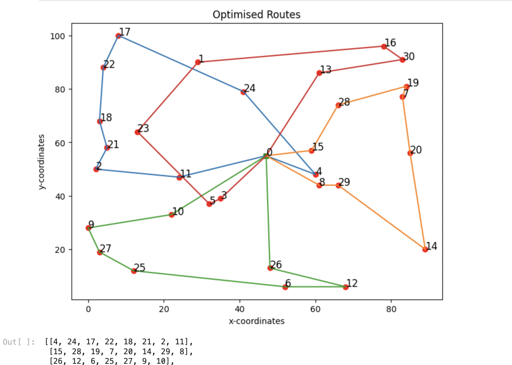

# Optimizing-Vehicle-Routes-using-Genetic-Algorithm
 
<h2>Vehicle Routing Problem</h2>

The Vehicle Routing Problem (VRP) involves finding the best routes for a fleet of vehicles to deliver goods or services to customers. Our version of VRP focuses on two main goals: minimizing the total distance traveled and balancing the workload so that no single vehicle gets worn out more than the others. This helps reduce overall travel costs and maintenance expenses while ensuring that all vehicles last longer and remain reliable. Optimizing VRP in logistics is crucial for businesses, as it leads to significant cost savings, better customer service, and a more efficient and sustainable transportation system.

 

 
<h2>Genetic Algorithm</h2>

Genetic algorithm (GA) is an artificial intelligence search method that uses the process of evolution and natural selection theory and is under the umbrella of evolutionary computing algorithms. It is an efficient tool for solving optimization problems.

In a genetic algorithm, a population of candidate solutions (called individuals, creatures, organisms, or phenotypes) to an optimization problem is evolved toward better solutions. Each candidate solution has a set of properties (its chromosomes or genotype) which can be mutated and altered.The evolution usually starts from a population of randomly generated individuals, and is an iterative process, with the population in each iteration called a generation. In each generation, the fitness of every individual in the population is evaluated; the fitness is usually the value of the objective function in the optimization problem being solved. The more fit individuals are stochastically selected from the current population, and each individual's genome is modified (recombined and possibly randomly mutated) to form a new generation. The new generation of candidate solutions is then used in the next iteration of the algorithm. Commonly, the algorithm terminates when either a maximum number of generations has been produced, or a satisfactory fitness level has been reached for the population

 
<h3>Project details </h3>

This project focuses on optimizing Vehicle Routes using a genetic algorithm implemented with the DEAP (Distributed Evolutionary Algorithms in Python) library

<h4>Setting Up Individuals</h4>

First, we define the basic components of our genetic algorithm, such as individuals and populations. In this context, individuals are candidate solutions to the VRP. Each individual represents a route for the vehicles, encoded as a permutation of location indices that each vehicle will visit. For example, if there are 30 locations to visit, an individual could be a sequence of these locations, indicating the order in which they are visited by the vehicles.

Specifically, the round-robin encoding scheme used here assigns indices to the locations for each vehicle in a round-robin fashion. The formula i + a * n_trucks,(where i is the index of the location, a is a whole number, and n_trucks is the total number of vehicles) determines the index included in a particular vehicle's path. This encoding ensures that each vehicle's route is represented in the individual, with each location being visited exactly once by exactly one vehicle, while also giving a more balanced solution

<h4>Genetic Operators</h4>

Crossover (cxPartialyMatched): This operator is chosen because it preserves the permutation nature of the problem, ensuring that offspring remain valid routes. It combines subsequences from two parents, maintaining the relative order and positioning of elements, which helps retain good characteristics from both parents and introduces diversity.

Mutation (mutShuffleIndexes): This operator introduces variability by shuffling a subset of the route indices, maintaining the permutation structure. It effectively explores new permutations and potential solutions without disrupting the overall structure too much, and ensures the resulting solution remains a valid permutation.

<h4>Representation of Solution</h4>

The optimal_paths matrix contains the optimised routes.The ith row of the matrix contains the indices of the locations, ith vehicle will visit

In the plot, different paths are represented by different colors.Locations are marked from 1 to n_locs ,while the depot is marked 0.

